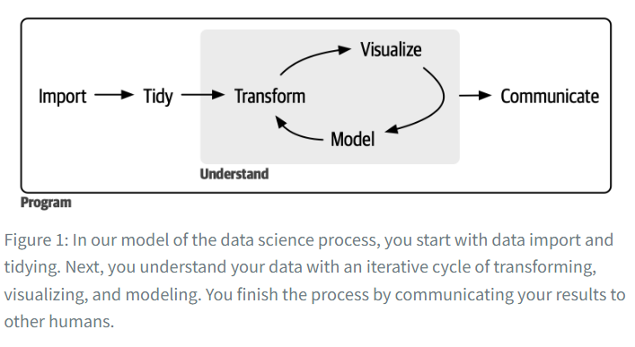

--- 
knit: "bookdown::render_book"
title: "Reading Notes on R4DS"
author: "Lingyun Zhang"
date: "`r Sys.Date()`"
site: bookdown::bookdown_site
output: bookdown::gitbook
documentclass: book
link-citations: yes
links-as-notes: true
colorlinks: true
---


```{r setup, include=FALSE}
knitr::opts_chunk$set(echo = TRUE)
```


# Preface {.unnumbered}

Here are my notes on reading **R for Data Science 2nd Ed**. The book's URL is: https://r4ds.hadley.nz/

This is only for my own study.

# Welcome

"This book will teach you how to do data science with R: You'll learn how to get your data into R, get it into the most useful structure, transform it and visualize."

# Introduction



1. "First, you must import your data into R. This typically means that you take data stored in a file, database, or web application programming interface (API) and load it into a data frame in R." [file; database; API]

1. "In brief, when your data is tidy, each column is a variable and each row is an observation."

1. "Once you have tidy data, a common next step is to transform it." [main engines are: `dplyr` and `data.table` packages]

1. "A good visualization will show you things you did not expect or raise new questions about the data. A good visualization might also hint that you're asking the wrong question or that you need to collect different data. Visualizations can surprise you, but they don't scale particularly well because they require a human to interpret them." ["A picture is worth than thousand words."]

1. "Models are fundamentally mathematical or computational tools, so they generally scale well." "But every model makes assumptions, and by its very nature, a model cannot question its own assumptions. That means a model cannot fundamentally surprise you."

1. "The last step of data science is communication, an absolutely critical part of any data analysis project." [communication]

1. "There's a rough 80/20 rule at play: you can tackle about 80% of every project using the tools you'll learn in this book, but you'll need other tools to tackle the remaining 20%." [80/20 rule]

1. "The tools you'll learn throughout the majority of this book will easily handle hundreds of megabytes of data, and with a bit of care, you can typically use them to work with a few gigabytes of data." [100 MB - a few GB] "If you're routinely working with larger data (10–100 GB, say), we recommend learning more about data.table."

1. "You need four things to run the code in this book: R, RStudio, a collection of R packages called the tidyverse, and a handful of other packages. Packages are the fundamental units of reproducible R code. They include reusable functions, documentation that describes how to use them, and sample data." [R; RStudio; tidyverse; other packages]

1. " Upgrading [R] can be a bit of a hassle, especially for major versions that require you to re-install all your packages, but putting it off only makes it worse." [Q: how to update R and easily re-install all R packages?]

1. "RStudio is an integrated development environment, or IDE" [IDE]

1. "An R package is a collection of functions, data, and documentation that extends the capabilities of base R." [R package]

# Data visualization

1. "ggplot2 implements the grammar of graphics, a coherent system for describing and building graphs." [grammar of graphics]

1. "aesthetic mappings and geometric objects – the fundamental building blocks of ggplot2" [aes; geo]

1. "ggthemes package, which offers a colorblind safe color palette." [ggthemes; colorblind safe]

1. [A population is a (tidy) table, where each row is for an item/unit/element and each column is an attribute of the items/units/elements.]

1. "Once you've made a plot, you might want to get it out of R by saving it as an image that you can use elsewhere. That’s the job of `ggsave()`"

# Workflow: basics

1. "You will make lots of assignments, and <- is a pain to type. You can save time with RStudio's keyboard shortcut: Alt + - (the minus sign)." [shortcut for <-]

1. "R will ignore any text after # for that line." [comment]

1. "Use comments to explain the why of your code, not the how or the what." [explain why in comment]

1. "For data analysis code, use comments to explain your overall plan of attack and record important insights as you encounter them." [plan and insights in comment]

1. "Object names must start with a letter and can only contain letters, numbers, _, and .." [object name]

1. "You want your object names to be descriptive, so you'll need to adopt a convention for multiple words. We recommend snake_case, where you separate lowercase words with _." [snake case]

1. R is case sensitive.

# Data transformation

1. "If you want to use the base version of these functions after loading dplyr, you'll need to use their full names: stats::filter() and stats::lag()." [full name of a function: pkgname::func_name]

1. "when we need to be precise about which package a function comes from, we'll use the same syntax as R: packagename::functionname()."

1. "The easiest way to pronounce the pipe is 'then'." [pipe]

1. dplyr verbs for rows: filter; arrange; distinct; count

1. dplyr verbs for columns: mutate; select; rename; relocate

1. "You can rename variables as you select() them by using =. The new name appears on the left hand side of the =, and the old variable appears on the right hand side"

1. "If you have a bunch of inconsistently named columns and it would be painful to fix them all by hand, check out janitor::clean_names() which provides some useful automated cleaning." [janitor::clean_names()]

1. keyboard shortcut Ctrl/Cmd + Shift + M for %>% or |>

1. The slice_ functions:

    - df |> slice_head(n = 1) takes the first row from each group.
    - df |> slice_tail(n = 1) takes the last row in each group.
    - df |> slice_min(x, n = 1) takes the row with the smallest value of column x.
    - df |> slice_max(x, n = 1) takes the row with the largest value of column x.
    - df |> slice_sample(n = 1) takes one random row.
    
1. "Whenever you do any aggregation, it’s always a good idea to include a count (n()). That way, you can ensure that you're not drawing conclusions based on very small amounts of data." [show the sample size] 

# Workflow: code style

1. "Using a consistent style makes it easier for others (including future-you!) to read your work and is particularly important if you need to get help from someone else." [future you]

1. "As a general rule of thumb, it's better to prefer long, descriptive names that are easy to understand rather than concise names that are fast to type." [descriptive names]

1. "if you have a bunch of variables that are a variation on a theme, you're better off giving them a common prefix rather than a common suffix" [common prefix]

1. "Pipe sign should always have a space before it and should typically be the last thing on a line." [pipe]

1. "be wary of writing very long pipes, say longer than 10-15 lines. Try to break them up into smaller sub-tasks, giving each task an informative name." [break long pipes]

1. "create these headers (Cmd/Ctrl + Shift + R)" [headers]

# Data tidying

1. "most built-in R functions work with vectors of values. That makes transforming tidy data feel particularly natural." [vectors]

1. "tidyr provides two functions for pivoting data: pivot_longer() and pivot_wider()." [pivot_longer; pivot_wider]

1. "A more challenging situation occurs when you have multiple pieces of information crammed into the column names, and you would like to store these in separate new variables." [multiple pieces of information in a column name]

1. "The examples we presented here are a selection of those from vignette("pivot", package = "tidyr"), so if you encounter a problem that this chapter doesn’t help you with, that vignette is a good place to try next." [vignette("pivot", package = "tidyr")]     

**Example:**

```{r, warning=FALSE, message=FALSE}
library(tidyverse)
 
tbl <-
  tribble(
    ~id, ~x_1, ~y_2,
    "a", 1,   2,
    "b", 3,   4,
    'c', 5,   6)
new_tbl <-
  tbl %>%
  pivot_longer(
    cols = x_1:y_2,
    names_to = c("name", "number"),
    names_sep = "_",
    values_to = "value"
  )
new_tbl
```


# Workflow: scripts and projects

1. "If you’re using RStudio server, your R session is never restarted by default." "This makes it even more important to regularly restart R so that you’re starting with a clean slate." [restart R]

1. "Keeping all the files associated with a given project (input data, R scripts, analytical results, and figures) together in one directory is such a wise and common practice that RStudio has built-in support for 
	this via projects." [project]   

1. "You should never use absolute paths in your scripts, because they hinder sharing: no one else will have exactly the same directory configuration as you."	[relative paths]

1. "we recommend always using the Linux/Mac style with forward slashes in paths." [forward slashes]

#  Data import

1. "CSV, which is short for comma-separated values"	[csv]

1. "By default, read_csv() only recognizes empty strings ("") in this dataset as NAs" ["" is default for NA]

1. "janitor::clean_names() to use some heuristics to turn them all into snake case at once" [janitor::clean_names(); snake case]
	
up to 7.3.2	


 
